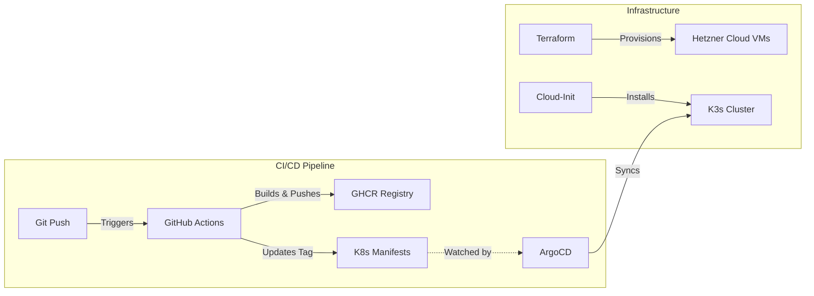

# Hetzner Cloud K3s GitOps Pipeline

This project serves as a reference implementation for a modern, GitOps-based CI/CD pipeline on **Hetzner Cloud** using **K3s**.

It demonstrates how to bootstrap a Kubernetes cluster using Terraform and manage application deployment automatically using GitHub Actions and ArgoCD.

## 🚀 Architecture

The pipeline follows a GitOps workflow where the configuration in this repository is the source of truth.



## 🛠 Tech Stack

-   **Cloud Provider**: [Hetzner Cloud](https://hetzner.cloud) (Cost-effective, reliable)
-   **Orchestrator**: [K3s](https://k3s.io) (Lightweight Kubernetes)
-   **Infrastructure as Code**: [Terraform](https://www.terraform.io/)
-   **CI**: [GitHub Actions](https://github.com/features/actions)
-   **CD**: [ArgoCD](https://argo-cd.readthedocs.io/)
-   **Registry**: GitHub Container Registry (ghcr.io)
-   **Application**: Node.js (Sample)

## 📂 Project Structure

```text
.
├── .github/workflows/   # CI/CD Workflows (GitHub Actions)
├── infra/               # Terraform Infrastructure Code
├── k8s/                 # Kubernetes Manifests (The "GitOps" State)
├── src/                 # Application Source Code
└── Dockerfile           # App Container Definition
```

## 🏁 Getting Started

### 1. Prerequisites
-   Hetzner Cloud API Token
-   Local `terraform` and `kubectl` installed.

### 2. Provision Infrastructure
```bash
cd infra
terraform init
terraform apply
# Enter your HCloud Token when prompted
```

### 3. Deploy
1.  Push this repository to GitHub.
2.  Add your `HCLOUD_TOKEN` to GitHub Secrets (optional, used if extending CI for Infra).
3.  The **GitHub Action** will automatically build the app and update the `k8s/deployment.yaml` file with the new image tag.
4.  Install ArgoCD on your cluster and apply `k8s/argocd-app.yaml`.
