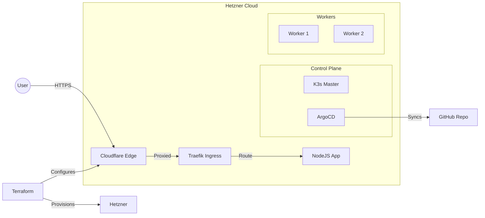

# 🍍 Terraform K8s ArgoCD Pipeline (Hetzner + Cloudflare)

A fully automated, zero-touch infrastructure pipeline that provisions a **K3s Kubernetes Cluster** on Hetzner Cloud, sets up **ArgoCD** for GitOps, and exposes services securely via **Cloudflare Proxy**.


## 🚀 Key Features

- **Infrastructure as Code**: Terraform provisions VMs, Firewalls, Private Networks, and Cloudflare DNS records.
- **Remote State**: Securely stored in **AWS S3** with state locking via **DynamoDB**.
- **Telegram Cluster Manager**: Control your entire cluster via Telegram (Deploy, Destroy, Get Logs, Get Nodes with IPs).
- **Automated Bootstrap**: Cloud-Init & Remote-Exec automatically install K3s, ArgoCD, and required CRDs. No manual `kubectl` required.
- **GitOps First**: ArgoCD watches this repo (`k8s/`) to manage the application loop.
- **Secure Networking**:
    - **Cloudflare Proxy**: Hides origin server IP. SSL Termination at the edge (Flexible/Full).
    - **Hetzner Firewall**: Strict rules allowing only Cloudflare, Internal CNI, and SSH.
    - **Private Network**: K3s nodes communicate over a private `10.0.1.0/24` network.
- **Observability**: Prometheus & Grafana stack included (managed via ArgoCD).
- **Fun Demo App**: A Node.js app featuring real-time metrics, visuals, and... falling pineapples 🍍.

## 🏗 Architecture



## 🛠 Tech Stack

- **Cloud**: Hetzner Cloud (Compute), Cloudflare (DNS/CDN)
- **Cluster**: [K3s](https://k3s.io) (Lightweight Kubernetes)
- **IaC**: [Terraform](https://www.terraform.io/)
- **GitOps**: [ArgoCD](https://argo-cd.readthedocs.io/)
- **CI**: GitHub Actions (Build -> Test -> Push to GHCR)
- **Language**: Node.js (App), HCL (Infra), YAML (Manifests)

---

## 🏁 Quick Start

### 1. Prerequisites
- **Hetzner Cloud Token**: Read/Write access.
- **Cloudflare API Token**: Zone DNS Edit access.
- **Cloudflare Zone ID**: The ID of the domain you own (e.g., `didiberman.com`).

### 2. Configure Infrastructure
Clone the repo and configure your secrets.

```bash
cd infra
cp terraform.tfvars.example terraform.tfvars
```

Edit `terraform.tfvars`:
```hcl
hcloud_token       = "your-hetzner-token"
cloudflare_api_token = "your-cloudflare-token"
cloudflare_zone_id   = "your-zone-id"
```

### 3. Provision & Bootstrap
Run Terraform to build the cluster and install ArgoCD and the App.

```bash
terraform init
terraform apply
```

> **What happens here?**
> 1. Terraform creates Servers, Firewalls, and Networks.
> 2. Cloud-Init installs K3s on the master and joins workers.
> 3. Terraform uses `remote-exec` to wait for the cluster, then installs ArgoCD & Cert-Manager manifests directly.
> 4. ArgoCD takes over and deploys the application.

### 4. Access the Cluster
Terraform outputs commands to set up your local environment:

**Get Kubeconfig:**
```bash
# Run the command output by Terraform to copy kubeconfig
$(terraform output -raw kubeconfig_command)
```

**Get ArgoCD Admin Password:**
```bash
# Retrieve the initial admin password
$(terraform output -raw argocd_password_command)
```

### 5. Access the Application
- **App URL**: [https://k8s.didiberman.com](https://k8s.didiberman.com) (Pineapples falling!) 🍍
- **ArgoCD UI**: Access via Port Forwarding:
  ```bash
  kubectl port-forward svc/argocd-server -n argocd 8080:443
  # Open https://localhost:8080
  ```

---

## 🤖 Telegram Cluster Manager

Manage your infrastructure directly from Telegram with real-time status updates.

### Features
- **🚀 Deploy**: Trigger a full Terraform Apply from your phone.
- **🗑 Destroy**: Safely tear down the infrastructure.
- **📦 Get Pods**: View all running pods across the cluster.
- **🖥 Get Nodes**: List cluster nodes with their **Status** and **IP Addresses**.
- **📺 Live Logs**: Watch the deployment progress stream in real-time.

### Bot Setup
The bot is deployed as an AWS Lambda function with an API Gateway webhook.
1.  **Bot Token**: Create a bot via [@BotFather](https://t.me/botfather).
2.  **Infrastructure**: Located in `telegram-bot/infra`.
3.  **Environment**: 
    - `TELEGRAM_BOT_TOKEN`: Your API token.
    - `ALLOWED_USERNAME`: Restrict access to your Telegram handle.
    - `GITHUB_TOKEN`: PAT to trigger Actions.
4.  **Credentials**: The specific Terraform apply output provides the `AWS_ACCESS_KEY_ID` and `AWS_SECRET_ACCESS_KEY` to use in your GitHub Secrets.

---

## 📂 Project Structure

```text
.
├── .github/workflows/   # CI/CD Workflows (GitHub Actions)
├── infra/               # Terraform (Hetzner + Cloudflare + Bootstrap)
│   ├── main.tf          # Main Infrastructure Definition
│   ├── cloud-init.yaml  # Server User Data
│   └── terraform.tfvars # (Ignored) Secrets
├── k8s/                 # Kubernetes Manifests (GitOps)
│   ├── argocd-app.yaml  # Root Application (App of Apps)
│   ├── ingress.yaml     # Traefik Ingress Route
│   └── ...              # Deployment, Service, Monitoring
├── src/                 # Node.js Application
└── README.md            # You are here
```

## 🐛 Troubleshooting

**Issue: `curl` or Browser returns 522 (Cloudflare Timeout)**
- **Cause**: The cluster firewall is blocking Cloudflare IPs.
- **Fix**: Ensure your `infra/main.tf` firewall rules allow TCP 80/443 from `0.0.0.0/0`.

**Issue: ArgoCD Sync Stuck**
- **Cause**: Race condition with CRDs (e.g., Prometheus `ServiceMonitor`).
- **Fix**: The repo uses `sync-wave` annotations (`-1`) to ensure CRDs install first. If stuck, delete the `monitoring` app in ArgoCD and resync.

---
*Built with ❤️ and 🍍 by Antigravity*
